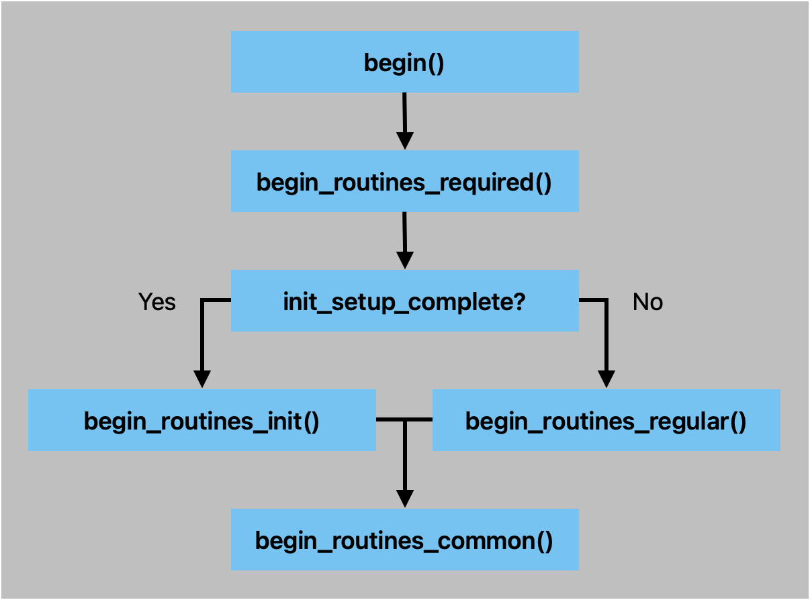

# Adding and Integrating a New Module

This guide details the technical steps to create a new module (`ModuleName`) and integrate it into the `SystemController`.

## 1. Module Creation

Determine if the module interacts primarily with **Hardware** or **Software**. Create the directory structure in `src/Modules/<Type>/ModuleName`.

**Example (Software Module):**

* `src/Modules/Software/ModuleName/ModuleName.cpp`
* `src/Modules/Software/ModuleName/ModuleName.h`
* `src/Modules/Software/ModuleName/README.md` (Recommended)

### Using Templates

Use the existing templates in `src_templates` as a base:

* Copy `src_templates/ModuleTemplate.h` -> `ModuleName.h`
* Copy `src_templates/ModuleTemplate.cpp` -> `ModuleName.cpp`

## 2. Implementation Details

Your class `ModuleName` inherits from `Module`. You must define a constructor. Overriding other functions is optional.

**Important:** When overriding parent methods, ensure the parent method is called within your implementation.

```cpp
void ModuleName::disable (const bool verbose, const bool do_restart) {
    // Custom disable routines here
    Module::disable(verbose, do_restart);
}

```

### Constructor Configuration

Define module properties in the constructor. Avoid running functional logic here; reserve logic for the `begin` routines.

```cpp
ModuleName::ModuleName(SystemController& controller)
      : Module(controller,
               /* module_name         */ "ModuleName",
               /* module_description  */ "Brief description",
               /* nvs_key             */ "key", // ~3 chars ideally
               /* requires_init_setup */ false,
               /* can_be_disabled     */ false,
               /* has_cli_cmds        */ false)
{}

```

#### Configuration Flags

* **`requires_init_setup`**: If `true`, runs `begin_routines_init()` once on the first boot after upload. Used for one-time configurations (e.g., WiFi network selection).
* **`can_be_disabled`**: If `true`, the module supports enable/disable functionality.
* **`has_cli_cmds`**: If `true`, enables CLI support.
* By default, adds `status` and `reset` commands.
* If `can_be_disabled` is also `true`, adds `enable` and `disable` commands.


### Defining CLI Commands

Define custom commands within the constructor body using `commands_storage`.

**Command Structure:**

```cpp
struct Command {
    string              name;
    string              description;
    string              sample_usage;
    size_t              arg_count;
    command_function_t  function;
};

```

**Implementation Example:**

```cpp
commands_storage.push_back({
    "add",
    "Add a button mapping: <pin> \"<$cmd ...>\" [pullup|pulldown] [on_press|on_release|on_change] [debounce_ms]",
    std::string("$") + lower(module_name) + " add 9 \"$system reboot\" pullup on_press 50",
    5,
    [this](std::string_view args){ button_add_cli(args); }
});

```

## 3. Lifecycle Logic (Begin Routines)

There are four specific initialization phases. You may not need all of them, but they provide flexibility.

1. **`begin_routines_required`**: Runs every boot.
2. **`begin_routines_init`**: Runs on first boot or after `$enable`.
3. **`begin_routines_regular`**: Runs on regular boot.
4. **`begin_routines_common`**: Runs at the end of the boot process.

> **Note:** `begin` methods are called even if the module is disabled. This ensures pointers are valid for other modules that may reference this module.

You can pass custom parameters to `begin()` using `ModuleNameConfig`.

## 4. Loop and Custom Functions

### Loop

Place routine execution code here. Avoid blocking functions (like `delay()`) as they affect the entire system.

### Custom Function Guidelines

If your module can be disabled, you must explicitly check the state at the start of every public custom function. External modules may call your functions even when your module is disabled.

```cpp
void ModuleName::custom_function () {
    // Safety check to prevent bugs when accessed by other modules
    if (is_disabled()) return;
    
    // Custom logic here
}

```

---

## 5. Integrating the New Module

Follow these steps to register `ModuleName` with the `SystemController`.

### Step 1: Update SystemController.h

In `src/SystemController/SystemController.h`:

1. Include the header:
```cpp
#include "../Modules/<Hardware|Software>/ModuleName/ModuleName.h"

```


2. Declare the member variable in `SystemController::public`:
```cpp
ModuleName module_name;

```


### Step 2: Update SystemController.cpp

In `src/SystemController/SystemController.cpp`:

**In `SystemController::SystemController()`:**

1. Initialize the module in the constructor list:
```cpp
, module_name(*this)

```


2. Add to the modules array:
```cpp
modules.push_back(&module_name);
```


**In `SystemController::begin()`:**

1. Define dependencies (if any) before initialization.
* *Example: If ModuleName requires WiFi:*


```cpp
module_name.add_requirement(wifi); 

```


2. Call `begin()`:
```cpp
module_name.begin(ModuleNameConfig {});

```


**Ordering Note:** Ensure your module initialization occurs before the command parser initialization:

```cpp
// should be initialized last to collect all cmds
command_parser.begin(CommandParserConfig {});

```

That's it, congrats on getting your module in.